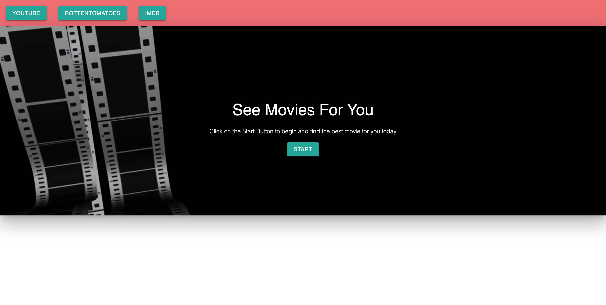
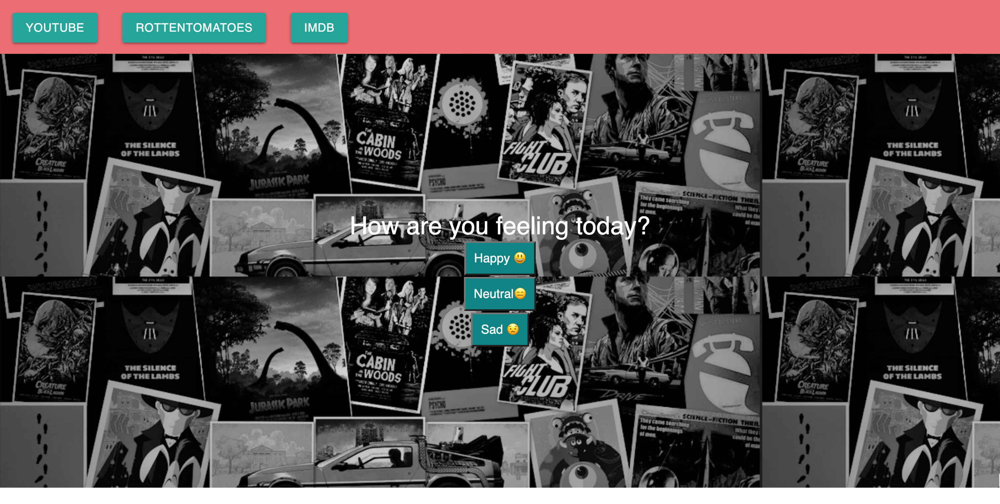
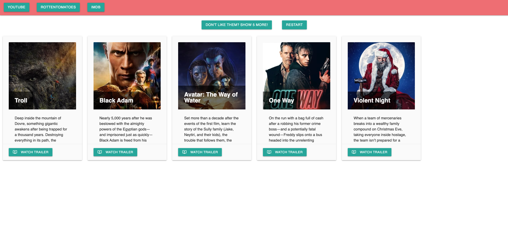

# What to Watch Today?

Have a quality README (with unique name, description, technologies used, screenshot, and link to deployed application).

## Description
Bored and don't know what to really watch?  
This website is used to help the user figure out what they can watch.  
This website will ask the user 5 questions to give them choices on what to watch.  
If the user doesn't like the choices shown, they can click the show 5 more to get other choices, or even restart the questions.
Also provide are links on the top for YouTube, RottenTomatoes, and IMDB to search more information on the movie choices.

## Built With
* HTML
* CSS
* JavaScript
* JQuery
* Materialize CSS
* 3rd Party APIs Used
    - https://api.themoviedb.org
    - https://youtube.googleapis.com

## Directions
Go to https://matt530bailey.github.io/what-to-watch-today/index.html

1.  Click on the Start button.

2.  Answer 5 set of questions by clicking on the buttons
For example:

3.  Your results of movies will be displayed.

4.  Click on the button "Watch Trailer" to view the trailer from Youtube.  Close the trailer and you can click on the others to view them!

5.  Click on the "Don't Like them? Show 5 more" to view more choices, or answer the questions again using the "Restart" button.

6.  Want to search and get more information on the movies.  Links are provided on the top of the page for YouTube, RottenTomatoes, and IMDB.

### Deployed Websites

## GitHub Link

https://github.com/matt530bailey/what-to-watch-today

